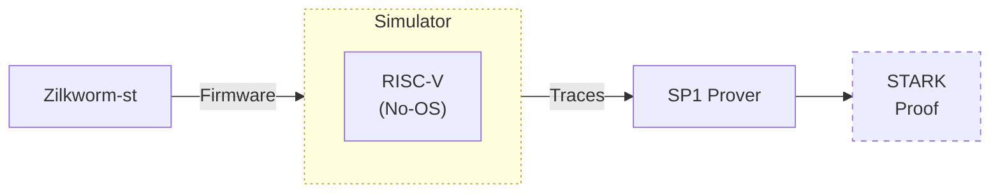

The actual code of Zilkworm acts as the guest program for a zkVM. In reality though, it's optimized for one or more provers and the minimal riscv32im ISA. The thing about integrating with a certain zkVM prover backend though is that one needs to be careful about its memory boundaries, hardware and environment limitations and provisions.

The zkVM internally generates an execution trace of the underlying riscv32im simulated machine and stitches the lines of execution, memory mutations and storage maps into a proof using the fabric of the constraints of each machine operation.

Nothing in the default pipeline actually assumes a particular proving system. The backend is a plugin. Today you might choose SP1; tomorrow you might test an alternative curve or commitment scheme. Zilkworm doesn’t change; only the witness packing and the backend library do.

In the following sections we will dive deeper into its details assuming the SP1-Prover backend.

### rv32im compilation

The target ISA such as rv32im is dictated by the underlying prover. In the description used here, SP1 backend for prover uses rv32im. This means the execution trace generation happens with a simulated CPU + memory + ROM in a bare-metal context. That is, the code for Zilkworm-state-transition function wholly runs as a "firmware" without any convenient OS system calls.

The target system of RV32IM means certain compiler and program constraints has to be kept in careful consideration.  Thirty-two-bit integer math has predictable behavior across compilers and is friendlier to constraint systems than ad-hoc 64-bit code paths. The build uses a standard cross-compiler (riscv32-unknown-elf-g++), with flags that keep the binary small and link-time GC aggressive.

### Rust–C++ bridge

A lot of prover code lives in Rust. Zilkworm keeps the execution engine and trace generation in C++ and crosses the boundary through a narrow FFI. There are two practical ways to do this. The first uses a C-compatible ABI: the Rust crate exposes extern "C" functions that accept raw pointers and lengths, and C++ wraps those in RAII helpers. The second uses a binding layer (such as cxx) to generate type-safe shims.

CMake invokes cargo and links the resulting library into the Zilkworm binary. Ownership and lifetimes are spelled out: the side that allocates returns a destructor; all buffers are length-delimited; no globals leak between language runtimes.

### EVMone core

Rather than reinvent EVM semantics, Zilkworm embeds EVMone. The tracing code does not introspect EVMone internals; it observes inputs and outputs at opcode boundaries and normalizes them into records with stable layouts. This matters when you later compare traces across compilers or machines: the format is always the same, and there is no hidden bookkeeping. When precompiles are involved, Zilkworm treats them as explicit events rather than a black box. The trace records the precompile id, inputs, and outputs so the witness either contains enough to re-derive the result or delegates to a host primitive through a well-defined channel.

### Precompiles provided by The Prover SDK via ECALL

Cryptographic operations are heavy, and the RV32IM guest has no business carrying entire big-number libraries if it can avoid it. For those, Zilkworm issues an ECALL with a service id that names the primitive (for example, a Keccak permutation or a BN254 group operation). Arguments are passed as pointers and lengths into guest memory. This pattern keeps the guest compact and also keeps the trace witness small. If the backend knows the primitive, it can treat the event as a constraint.
